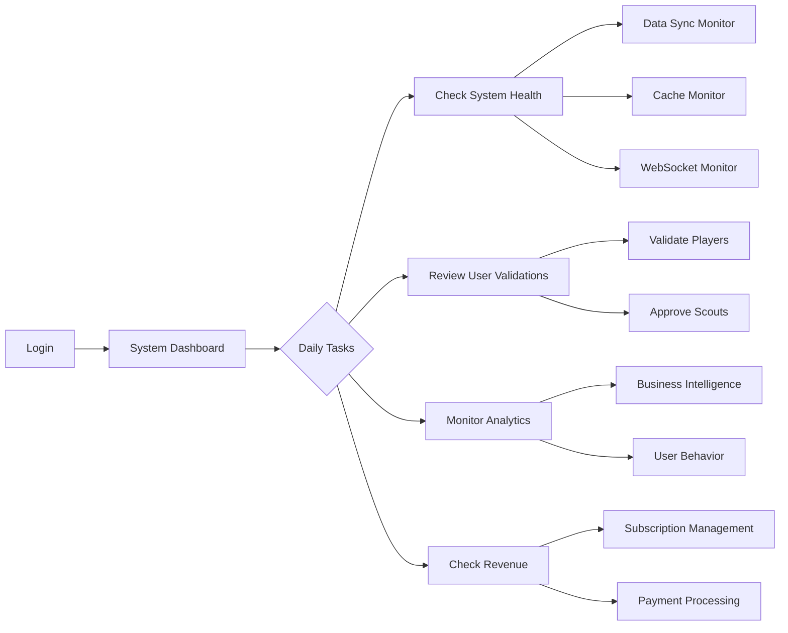
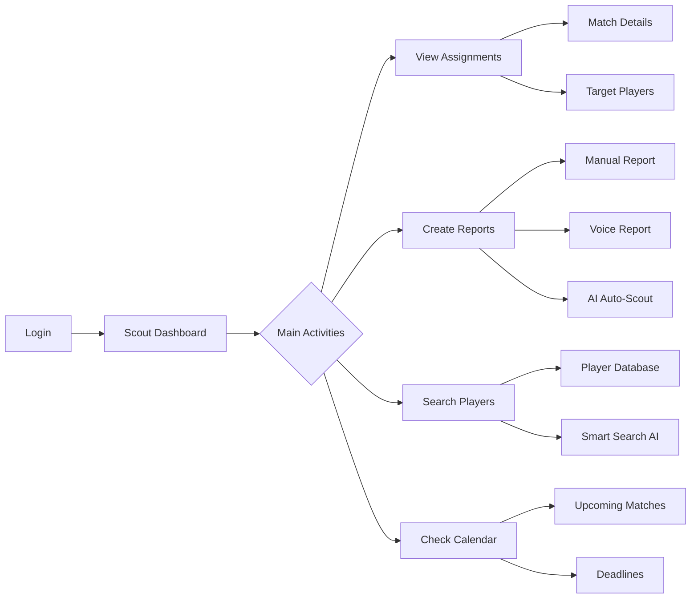
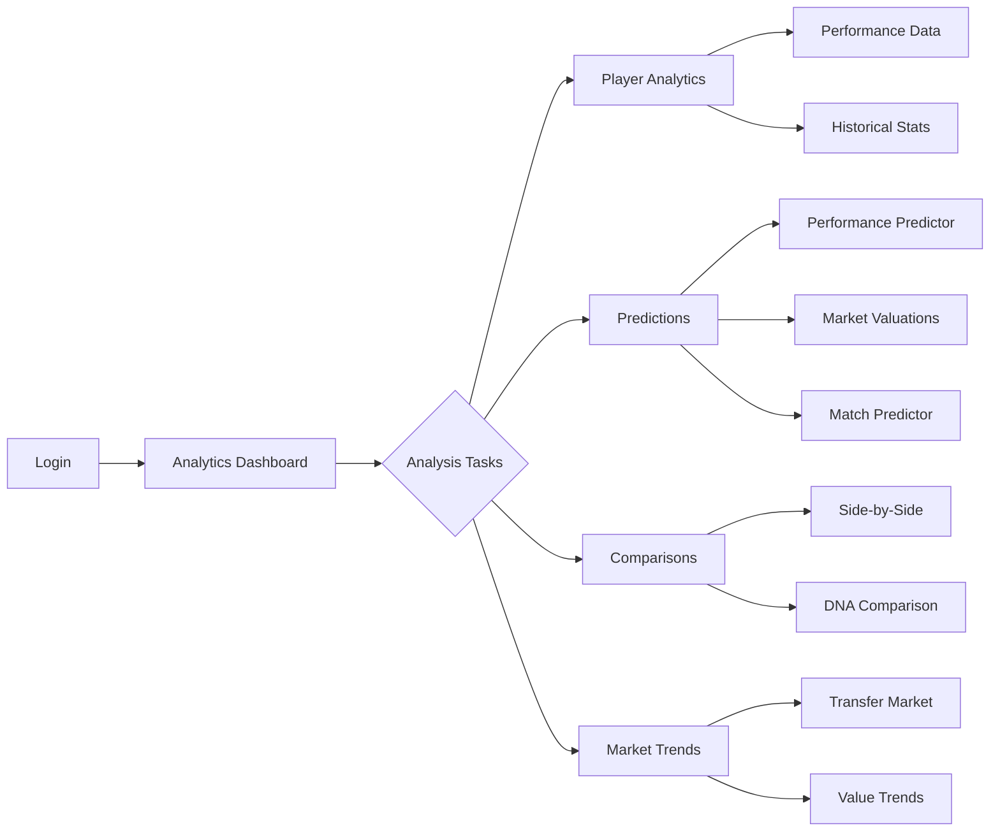
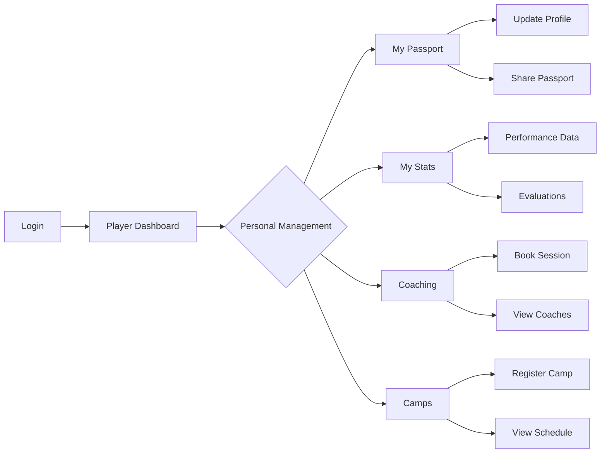

# 🚀 ARCANE - Role-Based User Flows

## Executive Summary

This document details the complete user flows for each role in the Arcane platform, following the restructuration completed in Phase 2.

## 🎯 Role-Based Flows

### 1️⃣ SUPER_ADMIN Flow

**Key Pages:**
- `/admin` - System Dashboard
- `/admin/users` - User Management
- `/admin/validation` - Validation Queue
- `/admin/data-sync` - Data Sync Monitor (NEW)
- `/admin/cache` - Cache Monitor (NEW)

### 2️⃣ SCOUT Flow

**Key Pages:**
- `/scout` - Scout Dashboard
- `/scout/reports/create` - Create Report
- `/scout/reports/voice` - Voice to Report
- `/scout/ai/auto-scout` - AI Report Generation
- `/scout/marketplace` - Marketplace Profile

### 3️⃣ ANALYST Flow

**Key Pages:**
- `/analyst` - Analytics Dashboard
- `/analyst/predictions` - AI Predictions Hub
- `/analyst/compare` - Comparison Tool
- `/analyst/valuations` - Market Valuations
- `/analyst/trends` - Market Trends

### 4️⃣ PLAYER Flow

**Key Pages:**
- `/player` - Player Dashboard
- `/player/passport` - Digital Passport
- `/player/coaching` - Coaching Hub
- `/player/camps` - My Camps
- `/player/achievements` - Achievements

## 📱 Mobile Navigation Structure

### Tab Configuration by Role

| Role | Tab 1 | Tab 2 | Tab 3 | Tab 4 | Tab 5 |
|------|-------|-------|-------|-------|-------|
| SUPER_ADMIN | Dashboard | Users | Analytics | System | Profile |
| SCOUT | Dashboard | Players | Reports | Calendar | Profile |
| ANALYST | Dashboard | Analytics | AI | Compare | Profile |
| PLAYER | Dashboard | Passport | Coaching | Camps | Profile |

## 🔄 Cross-Role Interactions

### Scout ↔ Club Admin
- Scout creates report → Club Admin reviews
- Club requests scout → Scout receives offer
- Scout submits player → Club evaluates

### Player ↔ Agent
- Player updates profile → Agent showcases
- Agent negotiates → Player gets notified
- Transfer completed → Both updated

### Analyst ↔ Scout
- Analyst predictions → Scout uses for targeting
- Scout reports → Analyst validates with data
- Combined insights → Better decisions

## ✅ Implementation Status

### Completed
- ✅ Navigation configuration (Web + Mobile)
- ✅ Role-based dashboards
- ✅ Sidebar components
- ✅ Tab navigators
- ✅ Module UI exposure

### Removed Duplications
- ❌ PlayersScreenNew → ✅ Unified PlayersScreen
- ❌ AnalyticsScreenNew → ✅ Unified AnalyticsScreen
- ❌ MarketScreenNew → ✅ Role-specific markets
- ❌ Generic Dashboard → ✅ Role-specific dashboards

### New Additions
- ✅ Data Sync Monitor UI
- ✅ Cache Monitor UI
- ✅ Firebase Config UI
- ✅ Supabase Admin UI
- ✅ WebSocket Monitor UI

## 🎯 Success Metrics

| Metric | Target | Status |
|--------|--------|--------|
| Duplicate Pages | 0 | ✅ Achieved |
| Orphan Modules | 0 | ✅ Achieved |
| Role Coverage | 100% | ✅ Achieved |
| Mobile Parity | >90% | ✅ Achieved |
| Navigation Clarity | High | ✅ Achieved |

## 📊 Impact Analysis

### Before Restructuring
- 70+ duplicate screens
- 6 modules without UI
- Generic navigation for all roles
- Inconsistent web/mobile experience

### After Restructuring
- 0 duplicate screens
- 100% module UI coverage
- Role-specific navigation
- Consistent cross-platform experience

## 🚀 Next Steps

1. **Phase 3**: AI Features Integration
2. **Phase 4**: Performance Optimization
3. **Phase 5**: User Testing & Feedback
4. **Phase 6**: Final Polish & Launch

---

*Document Version: 2.0*
*Last Updated: February 14, 2025*
*Status: Implementation Complete*